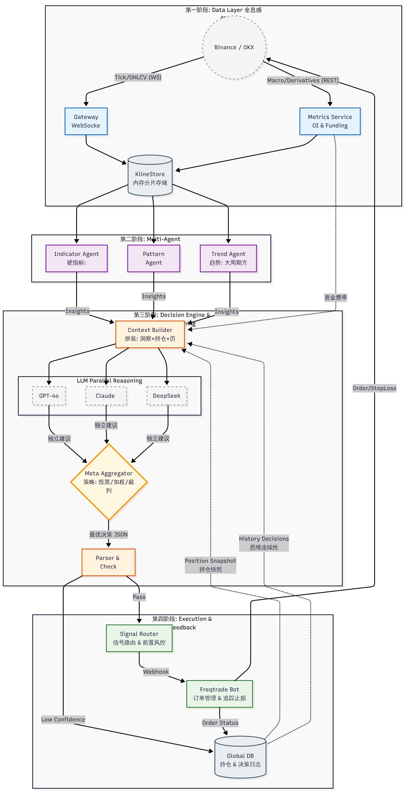

# Brale (Break a leg) 🎭

> **AI-Driven Multi-Agent Quantitative Strategy Engine**
>
> *Since this is a performance (trading), I wish you "Break a leg" (a successful show / big profits)!*

[](doc/README_CN.md)
[](go.mod)
[](LICENSE)

**Brale** is a quantitative trading system that cleanly decouples **"AI deep thinking"** from **"ultimate quantitative execution."** It generates high-win-rate decisions via multi-agent collaborative analysis (Trend, Pattern, Momentum) combined with LLMs (GPT, Claude, DeepSeek...), and then performs millisecond-level risk alignment through a highly optimized execution engine.
[Chinese Video Introduction](https://www.bilibili.com/video/BV1Ab2aB2EUY)

## ✨ Core Features

- 🧠 **Dual-Loop Architecture**:
  - **Slow Loop**: Triggered by the K-line alignment scheduler, using large models for multi-dimensional deep reasoning.
  - **Fast Loop**: Driven by the `Plan Scheduler`, providing millisecond-level price monitoring to ensure precise TP/SL execution.
- 🤖 **Multi-Agent Distributed Reasoning**:
  - **Indicator Agent**: Focuses on trend resonance of indicators like RSI, MACD, and ATR.
  - **Pattern Agent**: Identifies price action, SMC liquidity zones, and classic candle patterns.
  - **Trend Agent**: Filters noise and focuses on multi-timeframe structural direction.
- ⚙️ **Highly Configurable**:
  - **Dynamic Prompt Injection**: Configure independent prompt libraries per symbol (e.g., BTC, ETH, SOL).
  - **Flexible Strategy Library**: Define complex exit plans (tiered take-profit, dynamic ATR trailing stop) via YAML.
- 🛡️ **Passive Executor Mode**: Seamlessly integrates **Freqtrade** as the execution terminal. Brale keeps full control and uses Freqtrade's stable infrastructure for actual order placement, eliminating strategy-layer redundancy.
- ⚡ **High-Performance Go Core**: Concurrent handling of multi-symbol data fetching, indicator computation, and agent scheduling.

## 🏗️ Architecture Flow



## ⚠️ Risk Disclaimer

**Brale is an open-source tool for quantitative trading research and development. It is NOT financial investment advice. Cryptocurrency trading is highly speculative and carries significant risk. You may lose part or all of your invested capital. Do not invest funds you cannot afford to lose. Past performance does not indicate future results. Use Brale at your own risk.**

## 🚀 Quick Start (Docker)

### 1. Prepare Configuration

```bash
# Copy configs
cp configs/config.example.yaml configs/config.yaml
cp configs/user_data/freqtrade-config.example.json configs/user_data/freqtrade-config.json

# Notes:
# 1. Fill in your LLM API Keys in configs/config.yaml
# 2. Configure exchange API in configs/user_data/freqtrade-config.json (or use dry-run)
# 3. Adjust [ai.multi_agent], [ai.provider_preference], and cycle parameters in config.yaml / profiles.yaml
```

### 2. Start the Service

Recommended: one-command startup via Make. It will clean the environment, prepare data directories, and bring up services in order:

```bash
make start
```

## 🔌 Execution Layer (Pluggable)

Brale dispatches real orders through the `Execution Engine` abstraction. The default implementation is [Freqtrade](https://github.com/freqtrade/freqtrade), but the core logic is decoupled:

- **Decoupled logic**: Set `freqtrade.enabled` to `false` in `configs/config.yaml` to run AI analysis only.
- **Passive control**: Brale uses the Freqtrade API for Force Entry/Force Exit. Freqtrade's strategy file (`BraleSharedStrategy.py`) stays empty and serves only as an execution terminal.
- **Exit plan sync**: Brale's `Plan Scheduler` computes TP/SL levels in real time and sends close orders on trigger, providing more flexible AI-driven exits than native Freqtrade stop-loss.

## 🧩 Indicator System

Brale uses `go-talib` to compute multi-dimensional technical indicators with automatic configuration:

- **Trend**: EMA (21/50/200), MACD (bullish/bearish/flat)
- **Momentum**: RSI (overbought/oversold), ROC, Stochastic Oscillator
- **Volatility**: ATR (dynamic stoploss or slippage estimation)
- **Derivatives**: Open Interest (OI), Funding Rate - exchange support required

## 🤝 Contribution Guide

Contributions via Issues and Pull Requests are welcome!
1. Fork the repo
2. Create a feature branch (`git checkout -b feature/AmazingFeature`)
3. Commit changes (`git commit -m 'Add some AmazingFeature'`)
4. Push to your branch (`git push origin feature/AmazingFeature`)
5. Open a Pull Request

## 📄 License

This project is licensed under the MIT License - see [LICENSE](LICENSE) for details.

## 🙏 Acknowledgments

- [Freqtrade](https://github.com/freqtrade/freqtrade) - excellent crypto trading bot infrastructure
- [NoFxAiOS/nofx](https://github.com/NoFxAiOS/nofx) - inspiration for multi-agent decision prompts
- [adshao/go-binance](https://github.com/adshao/go-binance) - elegant Go Binance SDK
- [go-talib](https://github.com/markcheno/go-talib) - technical analysis library for Go
