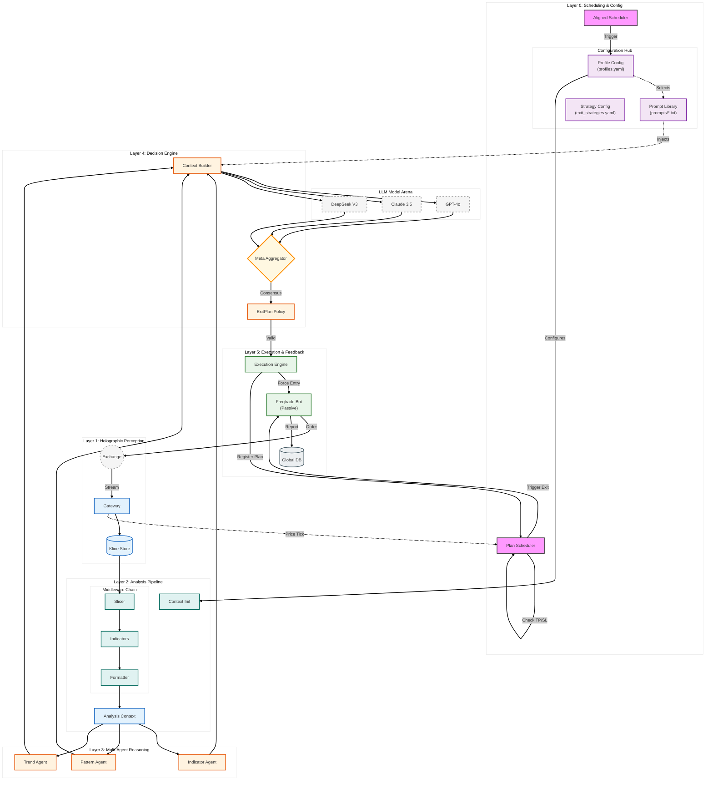

# Brale (Break a leg) 🎭

> **AI-Driven Multi-Agent Quantitative Strategy Engine**
> 
> *"Break a leg" in your trading journey!*

[](doc/README_CN.md)
[](go.mod)
[](LICENSE)

**Brale** is a quantitative trading system that perfectly decouples **"AI Deep Thinking"** from **"Quantitative Execution"**. It leverages multi-agent collaboration (Trend, Pattern, Momentum) combined with top-tier LLMs (GPT-4o, Claude 3.5, DeepSeek) to generate high-probability decisions, executed with millisecond-level risk alignment.

## ✨ Key Features

- 🧠 **Dual-Loop Architecture**:
  - **Slow Decision Loop**: Triggered by the Aligned Scheduler, performing multi-dimensional deep reasoning using LLMs at candle boundaries.
  - **Fast Execution Loop**: Driven by the `Plan Scheduler`, providing millisecond-level price monitoring for precise Take-Profit/Stop-Loss (TP/SL) execution.
- 🤖 **Distributed Multi-Agent Reasoning**:
  - **Indicator Agent**: Focuses on momentum resonance across RSI, MACD, and ATR.
  - **Pattern Agent**: Identifies Price Action, SMC liquidity zones, and classic candlestick patterns.
  - **Trend Agent**: Filters noise to focus on broader market structures across multiple timeframes.
- ⚙️ **Highly Configurable**:
  - **Dynamic Prompt Injection**: Supports independent prompt libraries for different symbols (e.g., BTC, ETH, SOL).
  - **Flexible Strategy Hub**: Define complex exit plans via YAML (tiered TP, dynamic ATR-based trailing stop-loss).
- 🛡️ **Passive Executor Mode**: Seamlessly integrates with **Freqtrade** as an execution terminal. Brale maintains full control, using Freqtrade's stable infrastructure for order fulfillment while keeping the strategy logic centralized in Brale.
- ⚡ **High-Performance Go Core**: Concurrent handling of multi-symbol data fetching, indicator calculation, and agent orchestration.

## 🏗️ Architecture




## ⚠️ Financial Disclaimer

**Brale is an open-source tool for algorithmic trading research and development. It is NOT financial advice. Trading cryptocurrencies is highly speculative and carries a high level of risk. You could lose some or all of your invested capital. You should not invest money that you cannot afford to lose. Past performance is not indicative of future results. Use Brale at your own risk.**

## 🚀 Quick Start (Docker)

### 1. Configuration

```bash
# Copy configuration templates
cp configs/config.example.yaml configs/config.yaml
cp configs/user_data/freqtrade-config.example.json configs/user_data/freqtrade-config.json

# Notes:
# 1. Fill in your LLM API Key in configs/config.yaml
# 2. Configure Exchange API in configs/user_data/freqtrade-config.json (or use dry-run mode)
```

### 2. Start Services

```bash
make start
```

## 🔌 Execution Layer (Pluggable)

Brale executes trades through an `Execution Engine` abstraction. The default implementation uses [Freqtrade](https://github.com/freqtrade/freqtrade), but it is decoupled:

- **Decoupled Logic**: Set `freqtrade.enabled` to `false` in `configs/config.yaml` to run only the AI analysis.
- **Passive Control**: Brale issues `Force Entry` and `Force Exit` commands via the Freqtrade API. The Freqtrade-side strategy (`BraleSharedStrategy.py`) is intentionally passive.
- **Exit Plan Synchronization**: Brale's `Plan Scheduler` calculates real-time exit points and triggers Freqtrade, allowing for AI-driven risk management far more flexible than native stop-losses.

## 🧩 Indicator System

Brale uses `go-talib` to calculate multi-dimensional technical indicators:

- **Trend**: EMA (21/50/200), MACD (bullish/bearish/flat)
- **Momentum**: RSI (overbought/oversold), ROC, Stochastic Oscillator
- **Volatility**: ATR (for dynamic stop-loss or slippage estimation)
- **Derivatives Data**: Open Interest (OI), Funding Rate (if supported by exchange).

## 🤝 Contributing

Issues and Pull Requests are welcome!
1. Fork this repository
2. Create your feature branch (`git checkout -b feature/AmazingFeature`)
3. Commit your changes (`git commit -m 'Add some AmazingFeature'`)
4. Push to the branch (`git push origin feature/AmazingFeature`)
5. Open a Pull Request

## 📄 License

This project is licensed under the MIT License - see the [LICENSE](LICENSE) file for details.